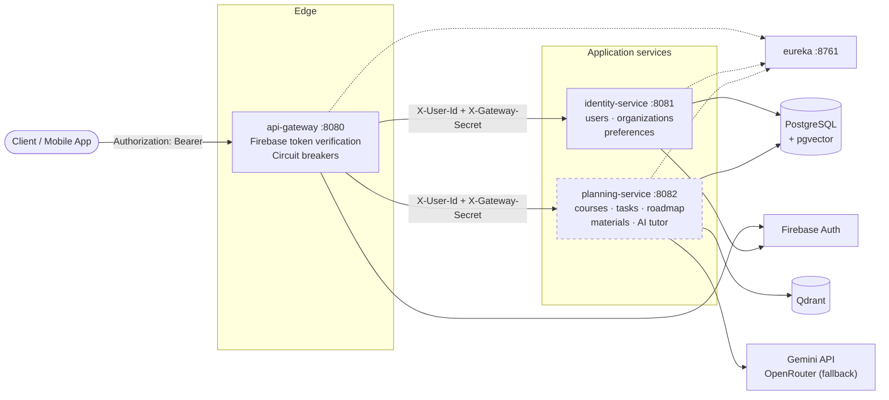

# SmartStudy Backend


Spring Boot microservice backend for **SmartStudy**, an AI study-planning assistant. Students upload
course material (PDFs); the platform extracts and indexes it into a vector store, generates an AI
study plan around their schedule and preferences, and powers a chat tutor grounded in that same
material — with cited sources.

## Architecture



> planning-service (dashed) has no published port — it is only reachable through the gateway, on the
> internal Docker network. See [Authentication model](#authentication-model) for why.

## Tech stack

| Layer | Technology |
| --- | --- |
| Language / runtime | Java 21 |
| Framework | Spring Boot 3.3.5, Spring Cloud 2023.0.3 |
| Service discovery | Netflix Eureka |
| Edge routing | Spring Cloud Gateway + Resilience4j circuit breakers |
| Inter-service calls | OpenFeign (load-balanced via Eureka) + Resilience4j fallbacks |
| Persistence | PostgreSQL 16 ([pgvector](https://github.com/pgvector/pgvector) image), Spring Data JPA, Flyway |
| Vector store | Qdrant 1.13 (gRPC, cosine similarity) |
| Authentication | Firebase Auth (ID-token verification) |
| AI | Google Gemini (embeddings, OCR, chat), Spring AI (planner agent), OpenRouter fallback |
| PDF processing | Apache PDFBox |
| API docs | springdoc-openapi (Swagger UI per service) |
| Build / deploy | Maven multi-module, Docker multi-stage images, Railway |

## Services

| Module | Port | Responsibility |
| --- | --- | --- |
| `eureka` | 8761 | Service discovery server (standalone mode). |
| `api-gateway` | 8080 | Single entry point; verifies Firebase tokens, injects trusted identity headers, routes to services via Eureka. |
| `identity-service` | 8081 | Firebase handshake, user profiles, onboarding preferences, organizations, GDPR account delete. |
| `planning-service` | 8082 *(internal)* | Core domain: courses, tasks, calendar events, roadmap, study sessions, teams, material-processing pipelines, and the AI chat tutor. |
| `shared-lib` | — | Shared DTOs (`ApiResponse`, `ErrorResponse`), typed exceptions, logging utilities. |

Databases are isolated per service: `identity_db` and `planning_db` (created by
`infra/postgres/init.sql`).

## Key features

### Material processing — two parallel pipelines per upload

**1. RAG indexing** (background poller, every 5 s):

```
PENDING → INDEXING → INDEXED / FAILED (auto-retry up to 3×)
```

1. **Extract** text with PDFBox; pages with little text get a **Gemini Vision OCR fallback**
   (rendered at 200 DPI → `gemini-2.0-flash`).
2. **Chunk** heading-aware (~800-token target, 100-token overlap, section hierarchy preserved).
3. **Embed** with `gemini-embedding-001` (768 dims, batches of 100).
4. **Index** into Qdrant collection `material_chunks` (cosine distance, payload-filtered by
   user/course/material). Failed indexing cleans up partial vectors.

**2. Study-plan generation** (async, right after upload): a Spring AI agent reads the extracted
PDF, proposes tasks (title, duration, sequence, covered sections), then packs them into available
time slots honoring daily study budget, preferred days, and exam dates — splitting oversized tasks,
merging trivial ones, and alerting when capacity is exceeded.

### Per-task chat tutor (RAG)

Embeds the student's question, retrieves the top-5 chunks for that course (score ≥ 0.5), and answers
with structured output: answer, whether context was used, confidence, suggested follow-up, and
cited `section`/`page` sources.

### Roadmap rescheduling

AI-assisted reschedule endpoint plus automatic triggers: missed-task detection, priority escalation
near exams, and rescheduling when preferences change.

### Everything else

Organizations & teams (invite codes, join requests, member approval), calendar events, timed study
sessions feeding streak/hour stats, dashboard aggregation, and GDPR-compliant account deletion.

## Getting started

### Prerequisites

- JDK 21
- Maven 3.9+
- Docker & Docker Compose
- A Firebase project with a service-account JSON key
- Google Gemini API key ([Google AI Studio](https://aistudio.google.com/))

### Configuration

```bash
cp .env.example .env   # then fill in the values below
mkdir credentials      # drop your Firebase key here as firebase-admin.json
```

Minimum required to boot the full stack:

| Variable | Notes |
| --- | --- |
| `GEMINI_API_KEY` | Chat, embeddings, OCR. **planning-service refuses to start without it.** |
| `SPRING_AI_GOOGLE_GEMINI_API_KEY` | Study-planner agent (yes, it's a *second* Gemini key — see gotcha below). |
| `POSTGRES_PASSWORD` | Change from default. |
| `GATEWAY_SHARED_SECRET` | Required in production; generate a long random string. |
| `FIREBASE_CREDENTIALS` | Path inside the container (default `/app/credentials/firebase-admin.json`). |

> ⚠️ **Two distinct Gemini keys.** The planner agent uses Spring AI's config property while chat /
> embeddings / OCR use a hand-rolled client. Setting only one causes subtle runtime failures in the
> other path — set both.

### Run the full stack

```bash
docker compose up --build
```

| Component | Host port (dev) | Notes |
| --- | --- | --- |
| api-gateway | `8080` | All client traffic goes here. |
| eureka console | `8761` | http://localhost:8761 |
| identity-service | `8081` | Swagger: http://localhost:8081/swagger-ui.html |
| planning-service | *not exposed* | Gateway-only by design. Swagger reachable via logs/internal tooling. |
| postgres | `5433` | pgvector-enabled image. |
| qdrant | `6333` / `6334` | HTTP dashboard / gRPC. |

First boot creates both databases and enables the `vector` extension automatically.

### Run services individually (no Docker)

Start Postgres, Qdrant, and Eureka first (via Docker or locally), then:

```bash
mvn -pl :eureka spring-boot:run
mvn -pl :identity-service spring-boot:run      # needs identity_db
mvn -pl :planning-service spring-boot:run      # needs planning_db + Qdrant + GEMINI_API_KEY
mvn -pl :api-gateway spring-boot:run
```

The `dev` profile defaults datasource hosts to `localhost` and enables `ddl-auto: update`.

## Authentication model

Two equivalent trust paths, enforced end-to-end:

1. **Direct:** client sends `Authorization: Bearer <Firebase ID token>`. Verified independently by
   the gateway *and* each service's Firebase filter.
2. **Gateway-forwarded (the normal path):** the gateway verifies the token, then strips any
   client-sent identity headers and injects `X-User-Id` / `X-User-Email` plus `X-Gateway-Secret`.
   Downstream services reject `X-User-Id` requests whose secret doesn't match.

Because planning-service is never exposed outside the Docker/Railway network, its `X-User-Id`
headers can't be spoofed by clients. Public endpoints (`/auth/handshake`, actuator, Swagger) bypass
verification at the gateway.

Organization accounts use the same Firebase identity — for org admins, the UID *is* the
organization id.

## API overview

All client requests go through the gateway under the `/api/v1` prefix (stripped before routing).
Several endpoints accept optional preference headers:
`X-Daily-Study-Minutes` (default 60) and `X-Preferred-Days` (default Mon–Sun).

Interactive docs: `/swagger-ui.html` on ports 8080–8082.

### identity-service

| Group | Endpoints | Purpose |
| --- | --- | --- |
| Auth | `POST /auth/handshake` *(public)*, `GET /auth/me`, `GET/PATCH /auth/calendar-sync` | First-login user creation, current-user info, calendar-sync flag. |
| Profile | `GET/PATCH /users/me/profile`, `DELETE /users/me` | Profile view (stats fetched live from planning-service), updates, GDPR delete. |
| Preferences | `GET/PUT /users/me/preferences` | Daily hours + preferred days; saves trigger an async roadmap reschedule. |
| Organization auth | `POST /organization/auth/register`, `/login`, `/logout`, `PATCH /update` | Org accounts and sessions. |
| Organization profile | `GET /organization/getProfile`, `POST /organization/updateProfile` | Served here because the org record lives in this DB. |
| Internal | `GET /internal/users/lookup?ids=…`, `GET /internal/organizations/lookup?ids=…` | Batch lookups for other services (≤500 ids, not routed via gateway). |

### planning-service

| Group | Endpoints | Purpose |
| --- | --- | --- |
| Courses | `GET/POST /courses`, `GET/PATCH/DELETE /courses/{courseId}` | Course CRUD; nested material/task/event listings. |
| Materials | `POST /courses/{courseId}/materials`, `DELETE …/materials/{materialId}` | One-step multipart upload or two-step (register metadata → binary). Deletion cleans up vectors and files. |
| Upload | `POST /upload/{materialId}` | Step 2 of two-step upload; kicks off async processing. |
| Tasks | `GET/POST /tasks`, `GET/PATCH/DELETE /tasks/{taskId}` | Study-task CRUD. |
| Calendar | `GET/POST /calendar/events` | List/filter and create events. |
| Roadmap | `GET /roadmap/weekly`, `POST /roadmap/reschedule` | Weekly plan view; AI reschedule honoring preferences. |
| Sessions | `POST /sessions/start`, `POST /sessions/{sessionId}/end` | Timed study sessions linked to course/task. |
| Dashboard | `GET /home/dashboard`, `GET /home/deadlines` | Aggregated stats/alerts and upcoming deadlines. |
| Chat | `POST /tasks/{taskId}/chat`, `GET /tasks/{taskId}/chat/messages`, `DELETE …` | RAG tutor per task: ask, paginated history, clear thread. |
| Teams (user) | `GET /teams`, `/teams/discover`, `/teams/search?q=`, `POST /teams/join`, nested courses/events | Browse and join teams. |
| Organization | `POST /organization/{orgId}/teams`, members/join-request management, team/course/event CRUD, photo & material file serving | Org-admin API (uid = organizationId). |
| Internal | `GET /internal/users/{userId}/stats` | Study hours / completed tasks / streak for profile enrichment. |

## Testing

```bash
mvn test                              # all modules
mvn -pl :planning-service -am test    # one module + its dependencies
mvn -pl :identity-service -am test
```

## Deployment

Deployed on **Railway** as one Railway service per module, built from this repo's Dockerfiles.

**See [docs/railway-deployment.md](docs/railway-deployment.md)** for service settings, the full
environment-variable list, Qdrant setup (including the IPv6 requirement), and the config-as-code
trap that has already caused one production outage.

Key differences between the compose files:

| | `docker-compose.yml` (dev) | `docker-compose.prod.yml` |
| --- | --- | --- |
| Host ports | Published for everything except planning-service | None (platform-managed) |
| Spring profile | `dev` (default) | `prod` hardcoded |
| Postgres init | Runs `init.sql` on first boot | Databases must pre-exist |
| Firebase credentials | Mounted from `./credentials/` | Provided via env vars |

## Project structure

```
mongez-backend/
├── api-gateway/            # Spring Cloud Gateway: routes, auth filter, circuit-breaker fallbacks
├── eureka/                 # Discovery server (standalone)
├── identity-service/       # Users, orgs, preferences (PostgreSQL)
├── planning-service/       # Core domain + AI: courses/tasks/roadmap, RAG pipeline, chat tutor
│   └── src/main/java/com/smartstudy/planning/
│       ├── processing/     #   PDF extract → chunk → embed → index (Qdrant)
│       ├── ai/             #   Study-planner agent (Spring AI) + scheduler engine
│       └── chat/           #   RAG chat tutor
├── shared-lib/             # Shared DTOs, exceptions, logging
├── docs/                   # railway-deployment.md
├── infra/postgres/init.sql # Creates both databases, enables pgvector
├── credentials/            # Local Firebase keys (gitignored — never commit)
└── docker-compose*.yml
```

## Security notes

Never commit key values — not even as YAML defaults. All credentials come from environment
variables: Railway service variables in production, your shell or a gitignored `.env` file locally.
The `credentials/` directory and any `firebase-service-account*.json` files are gitignored.

Additional hardening already in place:

- Identity headers injected only after gateway-side token verification; client-supplied
  `X-User-Id`/`Authorization` headers are stripped first.
- Shared-secret enforcement on every downstream request carrying `X-User-Id`.
- planning-service unreachable except through the internal network.
- Circuit breakers with graceful fallbacks on all inter-service calls.
